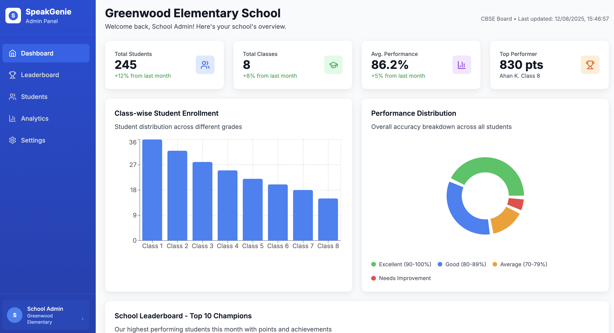
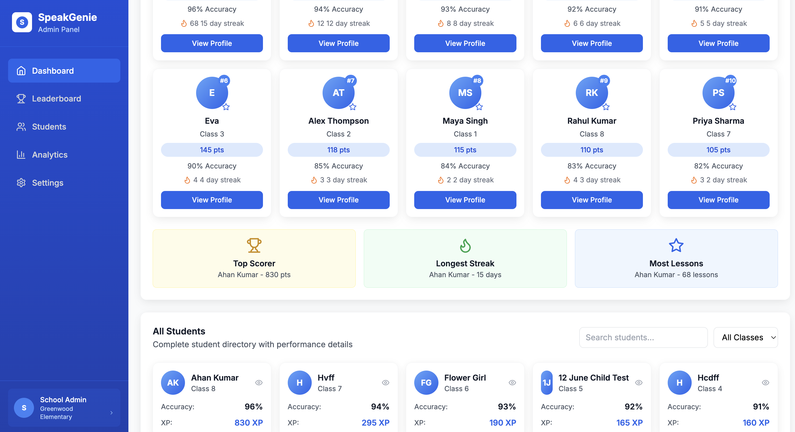
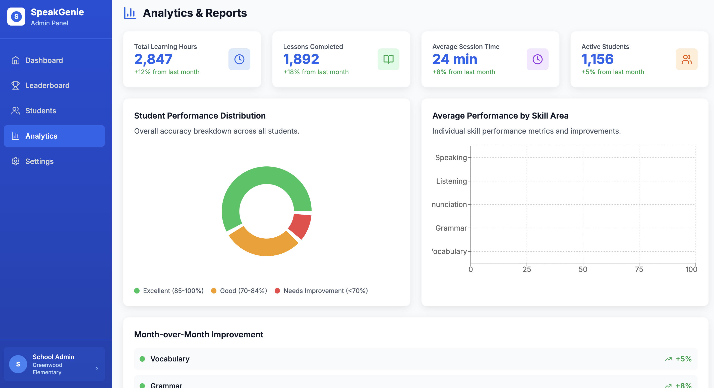
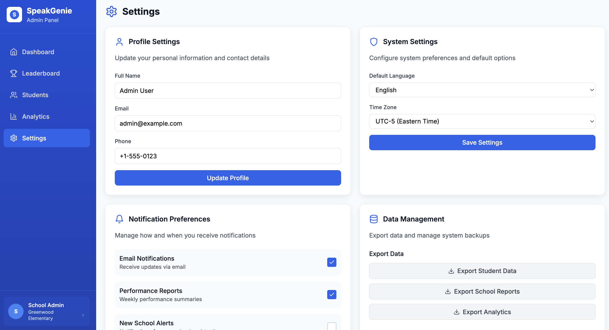
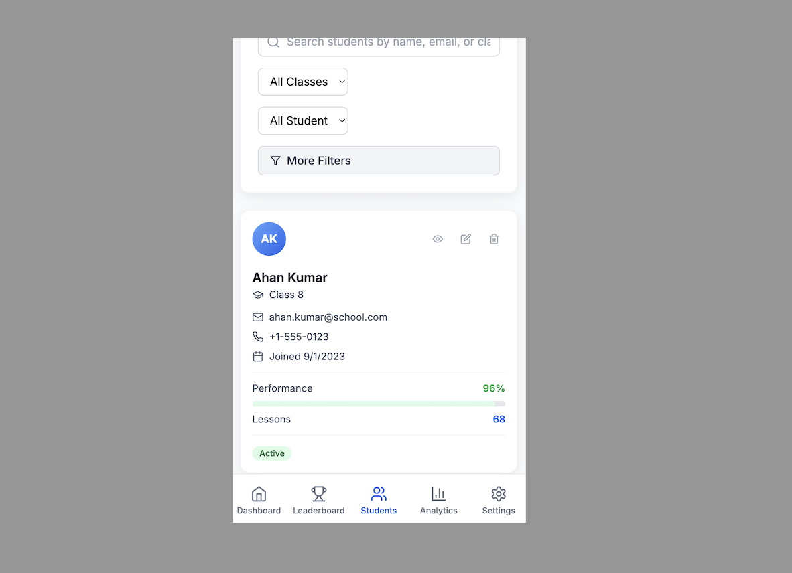

# SpeakGenie Admin Dashboard

A modern, responsive React TypeScript dashboard for school administration, featuring comprehensive analytics, student management, and performance tracking. Built with a mobile-first approach and beautiful UI design.

## 🖼️ Screenshots

### Desktop Views

*Main dashboard with key metrics, charts, and student leaderboard*


*School leaderboard with champions podium and complete rankings*


*Performance analytics with charts and engagement trends*


*Admin settings panel with profile and system configuration*

### Mobile Experience

*Mobile-optimized interface with bottom navigation bar*

## ✨ Features

- **📊 Dashboard**: Overview with key metrics, charts, and student leaderboard
- **🏆 Leaderboard**: Champions podium and complete student rankings with search & filters
- **👥 Students**: Student directory with search, filter, and management tools
- **📈 Analytics**: Performance distribution, skill analysis, and engagement trends
- **⚙️ Settings**: Profile management, system preferences, and data export
- **📱 Responsive Design**: Mobile-first approach with bottom navigation for mobile
- **📊 Interactive Charts**: Beautiful data visualization with Recharts
- **🎨 Modern UI**: Clean, professional design with smooth animations

## 🚀 Live Demo

Your dashboard is running at: **http://localhost:3000**

## 🛠️ Tech Stack

- **Frontend**: React 18 with TypeScript
- **Styling**: Tailwind CSS with custom components
- **Charts**: Recharts for data visualization
- **Icons**: Lucide React for consistent iconography
- **Build Tool**: Create React App
- **Package Manager**: npm

## 📱 Responsive Design

### Mobile Experience
- **Bottom Navigation Bar**: Icon-based navigation similar to mobile apps
- **Full-Width Content**: Optimized for small screens
- **Touch-Friendly**: Large buttons and proper spacing
- **No Sidebar**: Maximizes content area on mobile

### Desktop Experience
- **Left Sidebar**: Full navigation with school admin info
- **Wide Layout**: Optimal use of screen real estate
- **Professional Appearance**: Admin panel design
- **Fixed Sidebar**: Stays in place when scrolling

## 🎯 Key Components

### Dashboard View
- **Key Metrics Cards**: Total Students, Classes, Performance, Top Performer
- **Interactive Charts**: Class-wise enrollment bar chart, Performance distribution pie chart
- **Student Leaderboard**: Top 10 champions with rankings and achievements
- **All Students Grid**: Complete student directory with search and filters

### Leaderboard View
- **Champions Podium**: Top 3 students with visual ranking
- **Search & Filters**: Search students, filter by class and month
- **Complete Rankings**: Full student list with performance metrics
- **Summary Cards**: Current champion, longest streak, most active, highest accuracy

### Students Management
- **Student Cards**: Individual student profiles with performance data
- **Search & Filter**: Find students by name, class, or status
- **Action Buttons**: View, edit, and delete student records
- **Performance Metrics**: Visual performance indicators and progress bars

### Analytics & Reports
- **Performance Metrics**: Learning hours, lessons completed, session time, active students
- **Charts**: Performance distribution, skill area analysis, engagement trends
- **Improvement Tracking**: Month-over-month performance changes
- **Data Export**: Export capabilities for reports and analytics

### Settings Panel
- **Profile Settings**: Update personal information and contact details
- **System Settings**: Configure language and timezone preferences
- **Notification Preferences**: Manage email alerts and reports
- **Data Management**: Export data and create system backups

## 🚀 Getting Started

### Prerequisites

- Node.js 16+ 
- npm 8+

### Installation

1. Clone the repository:
```bash
git clone <repository-url>
cd speakgenie-admin-dashboard
```

2. Install dependencies:
```bash
npm install
```

3. Start the development server:
```bash
npm start
```

4. Open [http://localhost:3000](http://localhost:3000) in your browser.

### Build for Production

```bash
npm run build
```

## 📁 Project Structure

```
src/
├── components/          # React components
│   ├── Dashboard.tsx   # Main dashboard view
│   ├── Leaderboard.tsx # Student rankings
│   ├── Students.tsx    # Student management
│   ├── Analytics.tsx   # Data analytics
│   ├── Settings.tsx    # Settings panel
│   ├── Sidebar.tsx     # Desktop navigation sidebar
│   └── MobileNav.tsx   # Mobile bottom navigation
├── App.tsx             # Main app component with routing
├── index.tsx           # Entry point
├── index.css           # Global styles and Tailwind imports
└── types/              # TypeScript type definitions
```

## 🎨 Design Features

### Visual Design
- **Color Scheme**: Professional blue primary colors with consistent accent colors
- **Typography**: Inter font family for excellent readability
- **Shadows & Borders**: Subtle depth and visual hierarchy
- **Hover Effects**: Interactive feedback on all clickable elements
- **Smooth Animations**: CSS transitions for professional feel

### Layout System
- **Card-Based Design**: Clean, organized information display
- **Grid Layouts**: Responsive grids that adapt to screen size
- **Proper Spacing**: Consistent margins and padding throughout
- **Visual Hierarchy**: Clear information organization

## 📱 Mobile-First Features

### Responsive Breakpoints
- **Mobile**: < 768px - Bottom navigation, stacked layouts
- **Tablet**: 768px - 1024px - Hybrid layouts
- **Desktop**: > 1024px - Full sidebar, horizontal layouts

### Touch Optimization
- **Large Touch Targets**: Minimum 44px for buttons
- **Proper Spacing**: No accidental taps
- **Swipe Gestures**: Natural mobile interactions
- **Bottom Navigation**: Thumb-friendly positioning

## 🔧 Technical Features

### Performance
- **React 18**: Latest React features and optimizations
- **TypeScript**: Full type safety and IntelliSense support
- **Tailwind CSS**: Utility-first CSS for rapid development
- **Recharts**: Optimized chart rendering

### Code Quality
- **TypeScript**: Strict type checking
- **ESLint**: Code quality enforcement
- **Component Architecture**: Reusable, maintainable components
- **State Management**: React hooks for local state

## 🎯 Interactive Elements

- **Navigation**: Click between different dashboard sections
- **Responsive Design**: Resize browser to see mobile/tablet layouts
- **Search & Filters**: Test the search functionality across all views
- **Charts**: Hover over chart elements for detailed information
- **Buttons**: All buttons are clickable with hover effects

## 💡 Customization Ideas

### Branding
- **Colors**: Update the color scheme in `tailwind.config.js`
- **Logo**: Replace the "S" icon with your school logo
- **Typography**: Customize font families and sizes

### Functionality
- **Real Data**: Replace mock data with API calls to your backend
- **Authentication**: Integrate with your user management system
- **Real-time Updates**: Add WebSocket connections for live data
- **Additional Charts**: Add more chart types using Recharts

### Mobile Experience
- **Custom Icons**: Replace navigation icons with your preferred set
- **Color Themes**: Different color schemes for different user roles
- **Notifications**: Push notifications for important updates

## 🌐 Browser Support

- **Chrome** (latest)
- **Firefox** (latest)
- **Safari** (latest)
- **Edge** (latest)
- **Mobile browsers** (iOS Safari, Chrome Mobile)

## 🚀 Deployment

### Build for Production
```bash
npm run build
```

### Deploy Options
- **Vercel**: Zero-config deployment
- **Netlify**: Drag and drop deployment
- **AWS S3**: Static website hosting
- **GitHub Pages**: Free hosting for open source

## 🤝 Contributing

1. Fork the repository
2. Create a feature branch
3. Make your changes
4. Test thoroughly on mobile and desktop
5. Submit a pull request

## 📄 License

This project is licensed under the MIT License.

## 🆘 Support

For support and questions:
1. Check the browser console for errors
2. Ensure all dependencies are installed (`npm install`)
3. Restart the development server (`npm start`)
4. Clear browser cache and refresh
5. Open an issue in the repository

## 🎉 Acknowledgments

- **Tailwind CSS** for the utility-first CSS framework
- **Recharts** for beautiful, responsive charts
- **Lucide React** for consistent iconography
- **React Team** for the amazing framework

---

**Enjoy your new SpeakGenie Admin Dashboard! 🎉**

*Built with ❤️ using React, TypeScript, and Tailwind CSS* 